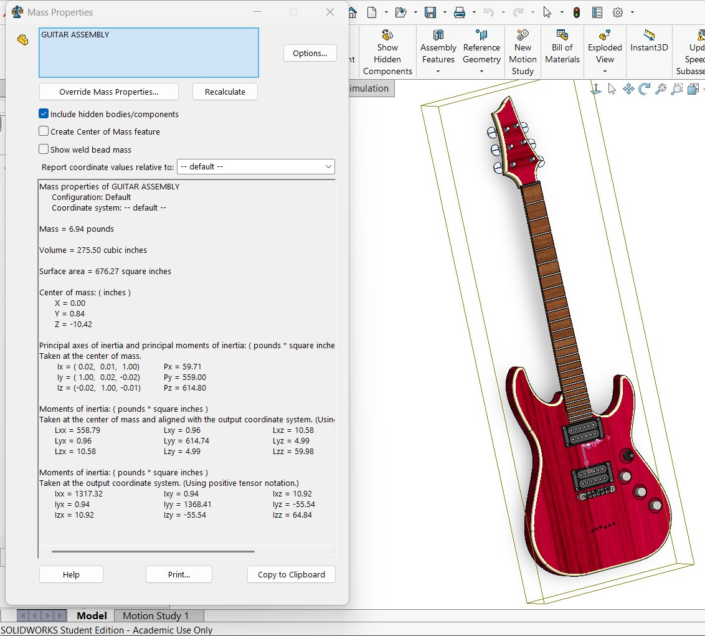
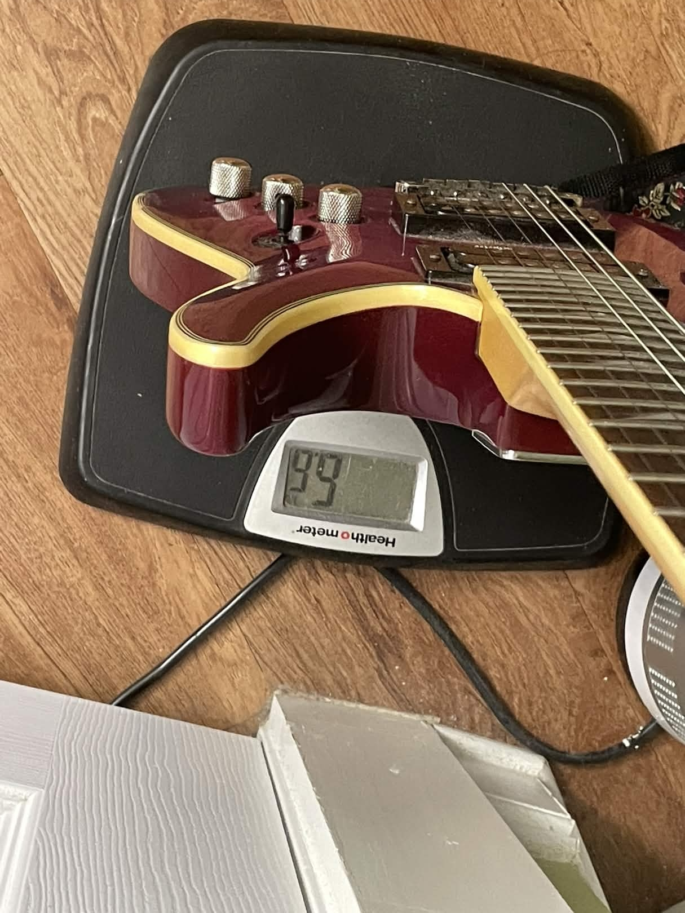

# Guitar CAD Model — Mass Properties Comparison

A SolidWorks model of my electric guitar, checked against the real instrument by comparing the model's calculated weight with the guitar's measured weight.

## Modeling approach

Every feature of the guitar was measured with calipers to keep the model as accurate as possible. Materials were assigned as follows:

| Component | Material |
| --- | --- |
| Body, neck | Mahogany |
| Pickups, switch | PF plastic |
| Knobs, bridge | Plain Carbon Steel |
| Tuners | 1060 Aluminum Alloy |

The real guitar weighed approximately **6.6 lb** on a bathroom scale. SolidWorks mass analysis of the assembly gave **6.94 lb**.

## Equations

$$\%\ \text{error} = \frac{\text{measured} - \text{theoretical}}{\text{theoretical}} \times 100$$

$$\text{deviation} = \text{measured} - \frac{\text{measured} + \text{theoretical}}{2}$$

## Results

**Table 2.** Volume/weight data

| | Volume (in³) | Weight (lb) |
| --- | --- | --- |
| Measured | N/A | ≈ 6.60 |
| Theoretical (SolidWorks) | 275.50 | 6.94 |
| % Error | N/A | −4.90 % |
| Deviation | N/A | −0.17 |

Additional SolidWorks output: surface area 676.27 in², center of mass at (0.00, 0.84, −10.42) in, principal moments of inertia Px = 59.71, Py = 559.00, Pz = 614.80 lb·in².

## Figures

| SolidWorks mass properties | Measured weight |
| :---: | :---: |
|  |  |
| *Figure 8. SolidWorks mass properties.* | *Figure 7. Measured weight using a bathroom scale.* |

## Reproducing the calculation

```bash
python mass_properties.py
```

Requires Python 3.8+ and no external packages. Input values live in [`data/mass_properties.json`](data/mass_properties.json).

## Repository layout

```
.
├── README.md
├── mass_properties.py
├── data/
│   └── mass_properties.json
└── images/
    ├── figure-07-measured-weight.jpg
    └── figure-08-solidworks-mass-properties.jpg
```
